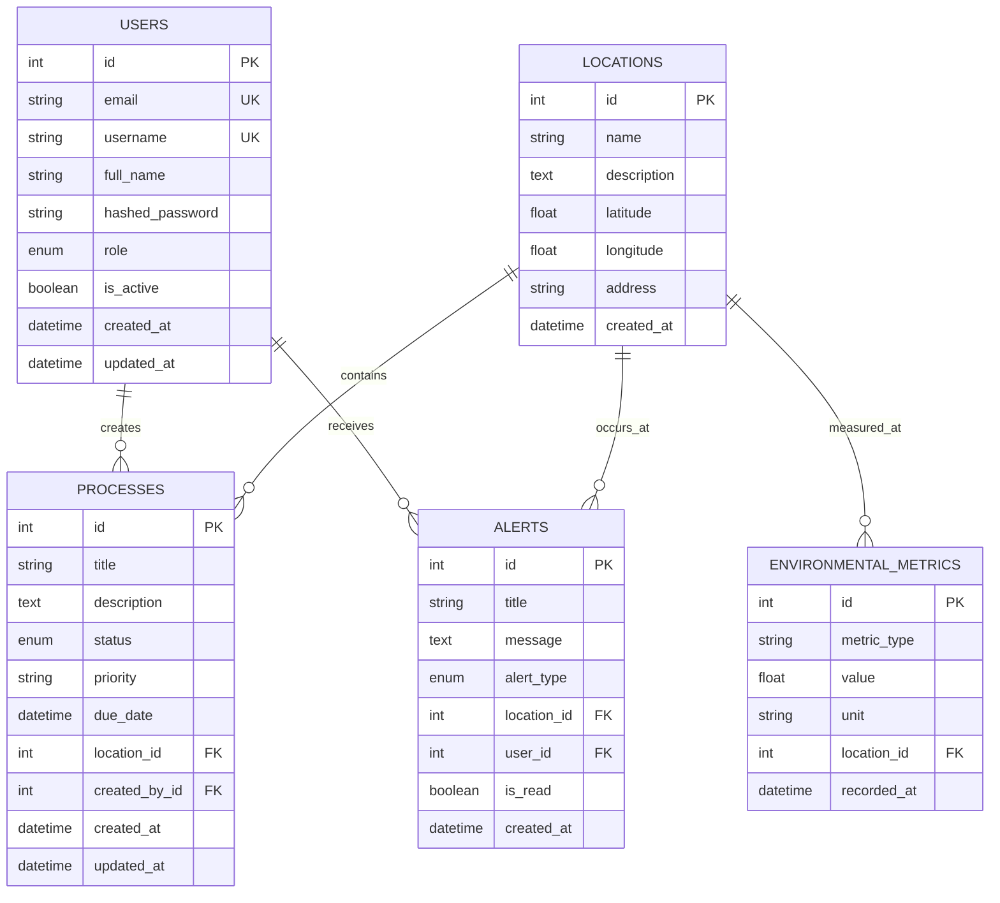

# Documentação do Banco de Dados - SyncaEco

**Data de geração:** 06/09/2025 00:20:11

## Visão Geral do Sistema

O SyncaEco é um sistema de gestão ambiental que utiliza SQLite como banco de dados para armazenar informações sobre:
- Usuários e controle de acesso
- Processos ambientais
- Localizações geográficas
- Alertas do sistema
- Métricas ambientais

## Arquivos de Banco de Dados Encontrados


### ecomanager.db
- **Tamanho:** 20480 bytes
- **Tabelas:** 1
- **Índices:** 3
- **Triggers:** 0
- **Views:** 0

### backend/ecomanager.db
- **Tamanho:** 0 bytes
- **Tabelas:** 0
- **Índices:** 0
- **Triggers:** 0
- **Views:** 0

## Estrutura das Tabelas

### Tabela: `users`
**Total de registros:** 1

#### Colunas

| Nome | Tipo | Nulo | Padrão | Chave Primária |
|------|------|------|--------|----------------|
| id | INTEGER | ❌ | - | 🔑 |
| email | VARCHAR | ✅ | - | - |
| username | VARCHAR | ✅ | - | - |
| full_name | VARCHAR | ✅ | - | - |
| hashed_password | VARCHAR | ✅ | - | - |
| role | VARCHAR | ✅ | - | - |
| is_active | BOOLEAN | ✅ | - | - |

#### Dados de Exemplo

```json
{
  "id": 1,
  "email": "admin@ecomanager.com",
  "username": "admin",
  "full_name": "Administrador do Sistema",
  "hashed_password": "***masked***",
  "role": "admin",
  "is_active": 1
}
```


## Modelos Python (SQLAlchemy)

O sistema define os seguintes modelos no arquivo `backend/app/models/models.py`:

### Enumerações

#### UserRole
- `ADMIN`: Administrador do sistema
- `MANAGER`: Gerente ambiental
- `ANALYST`: Analista ambiental  
- `VIEWER`: Visualizador (apenas leitura)

#### ProcessStatus
- `PENDING`: Pendente
- `IN_ANALYSIS`: Em análise
- `APPROVED`: Aprovado
- `REJECTED`: Rejeitado
- `EXPIRED`: Expirado

#### AlertType
- `WARNING`: Aviso
- `ERROR`: Erro
- `INFO`: Informação
- `SUCCESS`: Sucesso

### Relacionamentos Entre Tabelas



## Configuração do Banco de Dados

### Configurações Atuais
- **Tipo:** SQLite
- **Arquivo:** `ecomanager.db` (raiz do projeto)
- **URL de Conexão:** `sqlite:///./ecomanager.db`
- **ORM:** SQLAlchemy

### Scripts de Inicialização

O sistema inclui scripts SQL para inicialização:

#### `scripts/init-database.sql`
- Criação de usuário e banco PostgreSQL (para produção)
- Configuração de extensões (uuid-ossp, pg_trgm)

#### `scripts/sample-data.sql`
- Dados de exemplo para desenvolvimento
- Usuários padrão (admin, manager, analyst)
- Localizações de exemplo
- Processos e alertas de demonstração

## Schemas Pydantic

O sistema utiliza Pydantic para validação de dados com schemas para:
- **User**: Gestão de usuários e autenticação
- **Process**: Processos ambientais
- **Location**: Localizações geográficas
- **Alert**: Sistema de alertas
- **EnvironmentalMetric**: Métricas ambientais
- **Dashboard**: Dados para dashboard

## Observações Importantes

1. **Estado Atual**: O banco possui apenas a tabela `users` criada com 1 registro
2. **Migração Necessária**: As demais tabelas precisam ser criadas via migrações
3. **Ambiente de Desenvolvimento**: Usando SQLite para desenvolvimento
4. **Produção**: Configurado para PostgreSQL (ver init-database.sql)
5. **Autenticação**: JWT com hash bcrypt para senhas

## Próximos Passos

Para completar a inicialização do banco:
1. Executar migrações para criar todas as tabelas
2. Popular com dados de exemplo usando `scripts/sample-data.sql`
3. Configurar backup automático
4. Implementar índices para otimização de performance

---
*Documentação gerada automaticamente em {datetime.now().strftime('%d/%m/%Y %H:%M:%S')}*
